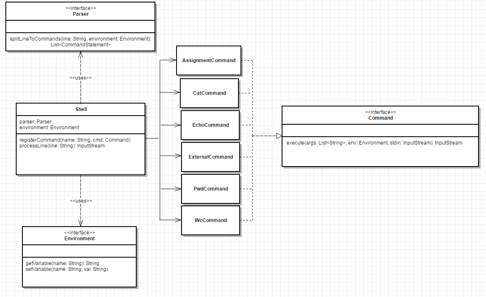

`Parser` разбивает строку на набор команд, разделенных пайпом.
Команда - ее имя и список аргументов.

`Shell` позволяет запускать команды. Для того, чтобы добавить в него команду, надо вызвать метод `registerCommand`.
Команды присваивания и внешние команды зарегестрированы по умолчанию 

## UML диаграмма

## Аргументы команд
Для парсинга аргументов используется Apache CLI, она достаточно удобная 
в использовании, предоставляет все то, что сейчас нужно для работы с аргументами,
количество кода, необходимое для работы с ней, значительно меньше, чем для других библиотек